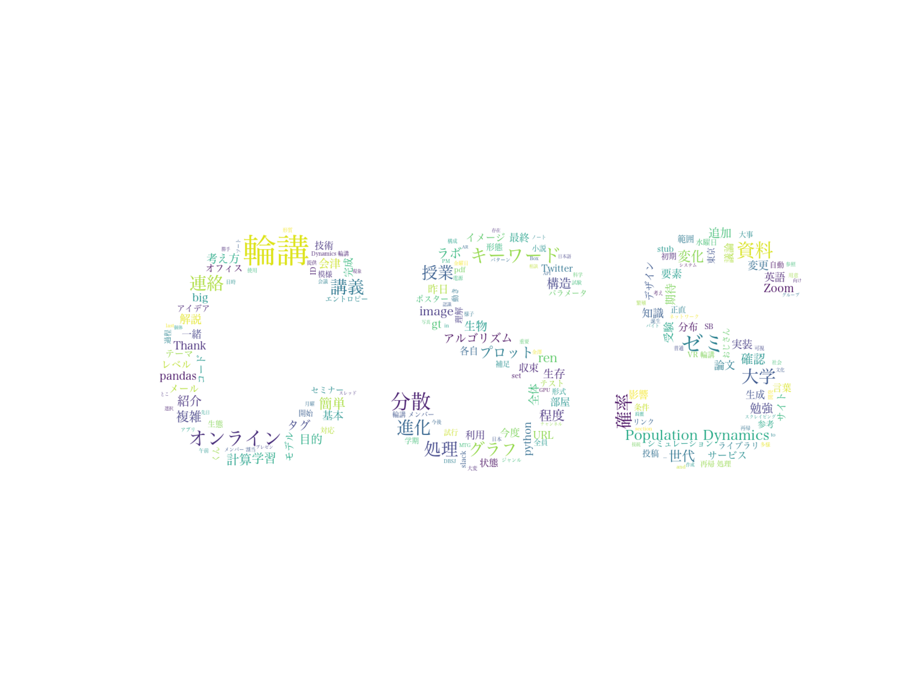

# lab_WordCloud
研究室を象徴するWordCloudを作成する。slackのトークデータから生成する。任意の形の画像を用意することで、その形に合わせたWordCloudを作成することも可能。

## Instllation
環境
* Mac OS
* pip
* python3.9.1

ライブラリをインストール
```
pip3 install -r requirements.txt
```

## Demo
```
python3 main.py -c random articles diary seminar -path ./data/css-lab-data/  -mask css-lab.png
```



## Option

| 引数    | 内容    |
| --- | --- | 
|   -c  |   チャンネル名を指定する。入力必須。複数ある場合は、１文字開けて入力する。  | 
|  -path  |  slackのトークデータのパス。入力必須。 |
|   -mask  | 指定した形のWordCloudを作成する。    |